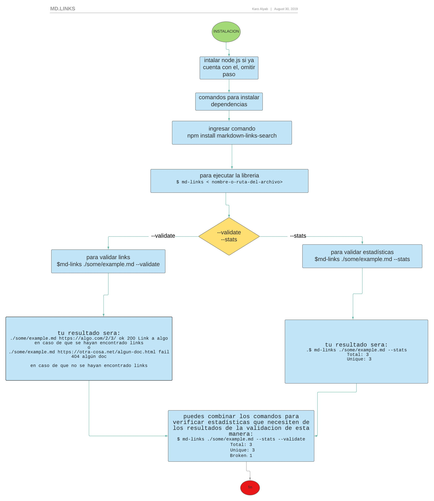

# Markdown Links

El proposito de este proyecto es crear una herramienta usando [Node.js](https://nodejs.org/en/) para leer archivos y enlaces en formato [Markdown](https://es.wikipedia.org/wiki/Markdown). Verifica en su contenido los links, indica su estatus y algunas estadisticas.

# Instalación
npm i --global carolinaab-md-links

# Uso

const mdLinks = require("md-links");

// Caso 1 .- Ruta relativa sin options
mdLinks("./some/example.md")
  .then(links => {
    // => [{ href, text, file }]
  })
  .catch(console.error);

// Caso  .- Ruta relativa con option (validate)
mdLinks("./some/example.md", { validate: true })
  .then(links => {
    // => [{ href, text, file, status, ok }]
  })
  .catch(console.error);

// Caso 3 .- Ruta relativa de un directorio sin options
mdLinks("./some/dir")
  .then(links => {
    // => [{ href, text, file }]
  })
  .catch(console.error);

//PD: Pueden presentarse más casos.
# Versión
1.0.0
# Documentación Utilizada
* [node.js documentation](https://nodejs.org/es/docs/)
* [File Sistem](https://nodejs.org/api/fs.html)
* [Nodejs Curso Desde Cero, para principiantes](https://youtu.be/BhvLIzVL8_o)
* [tutorialpoin node.js](https://www.tutorialspoint.com/nodejs/index.htm)
# Planificación
Para este proyecto se utiliza issues y milestones

## 10. Checklist logros 
### General

- [✔] Puede instalarse via `npm install --global <github-user>/md-links`
### `README.md`
- [✔] Documentación técnica de la librería.
### Pruebas / tests

- [✔] Pruebas unitarias cubren un mínimo del 70% de statements, functions,
      lines, y branches.
- [✔] Pasa tests (y linters) (`npm test`).
### CLI

- [✔] Expone ejecutable `md-links` en el path (configurado en `package.json`)
- [✔] Se ejecuta sin errores / output esperado

# Diagrama

